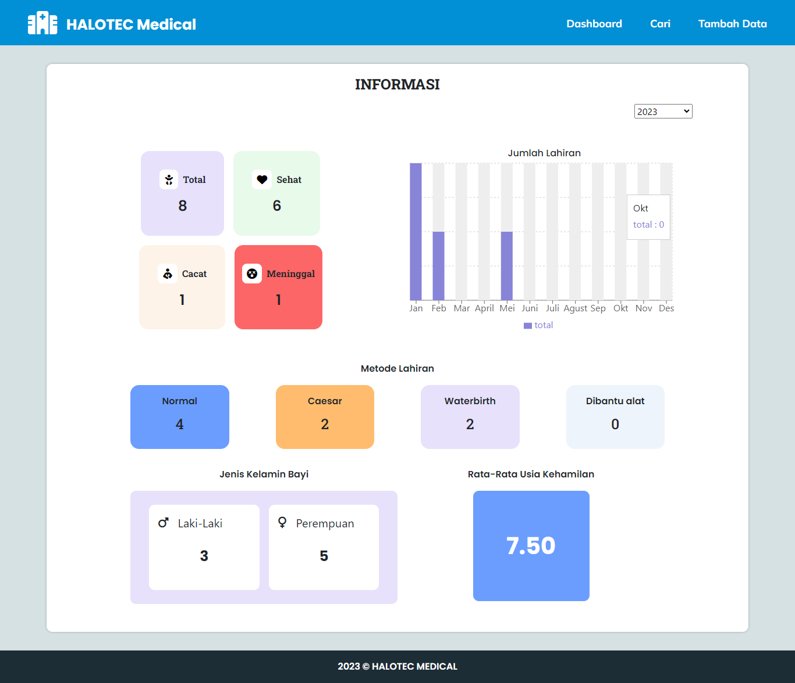
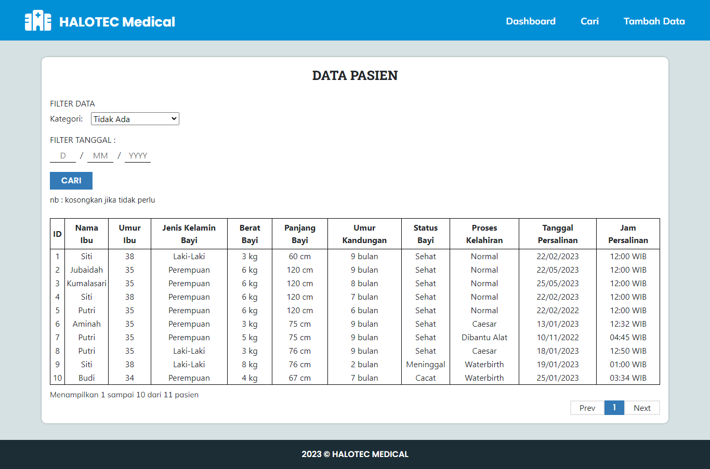

<div align="center">
  <h2 align="center">HALOTEC Medical</h2>

  <p align="center">
    <br />
    <a href="#"><strong>Explore the docs »</strong></a>
    <br />
    <br />
    <a href="https://helotec-app.vercel.app/">View Demo</a>
    ·
    <a href="#">Report Bug</a>
    ·
    <a href="#">Request Feature</a>
  </p>
</div>

## Built With

<p align="left">
  <a href="https://skillicons.dev">
    
  </a>
</p>

</div>

## Contents

- [Built With](#built-with)
- [Contents](#contents)
- [How to Run the Application](#how-to-run-the-application)
  - [1. Clone this repository](#1-clone-this-repository)
  - [2. Install dependency packages](#2-install-dependency-packages)
  - [3. Run projects](#4-run-projects)
- [Deployment](#deployment)
- [Screenshots](#screenshots)

<!-- ## Features

### Public

- Login
- Register
- Forgot Password
- Transfer
- Transfer History
- Edit Profile
- Dashboard -->

## How to Run the Application

### 1. Clone this repository

Clone this repository by run the following code:

```
$ git clone <this-repo-url>
```

### 2. Install dependency packages

Install dependency packages by run the following code inside project folder:

```
$ npm install
```

### 3. Run projects

Run this projects by run the following code:

```
$ npm start
```

It runs the app in the development mode.\
Open [http://localhost:3000](http://localhost:3000) to view it in your browser.

The page will reload when you make changes.\
You may also see any lint errors in the console.

## Deployment

[Vercel deploy link](https://helotec-app.vercel.app/)

## Related Project

[HALOTEC Medical Backend](https://helotec-be.vercel.app/)

## Screenshots

<div align="center">




</div>